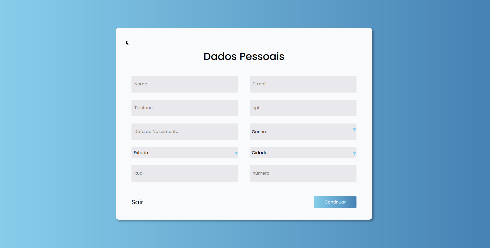
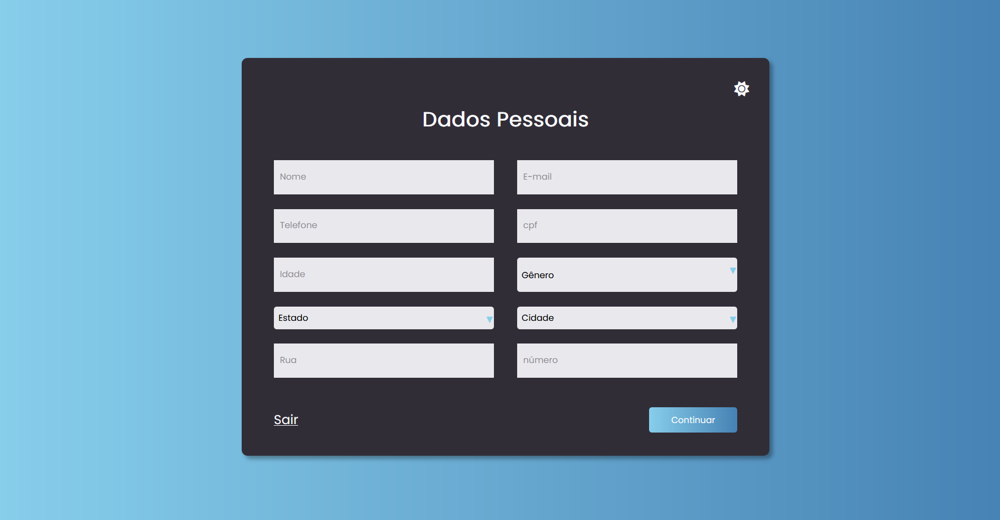

# Página de Inscrição - Trilhas Inova

## Descrição
Este projeto consiste no Desafio 2 do programa Trilhas Inova. A iniciativa é uma parceria entre o Governo do Estado do Maranhão, a Secti e a Fapema, com o objetivo de capacitar jovens na área de tecnologia.

## Objetivo
- Realizar e entregar o estudo e refinamento para desenvolvimento de uma página de inscrição.
- Entregar um formulário em HTML e CSS.

## Design
O design da página de inscrição está disponível nas versões ligth e dark. Abaixo estão as imagens de referência:

### Design Light

### Design Dark

## Tecnologias Utilizadas
- HTML
- CSS
- JavaScript

## Autor
[Guilherme de Pádua Ferreira Amorim]

## Licença
Este projeto está licenciado sob a Licença [MIT](https://opensource.org/licenses/MIT).

