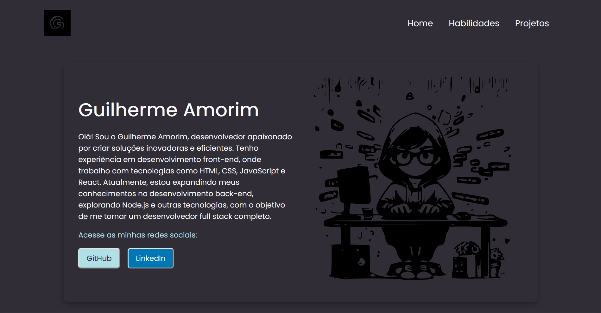
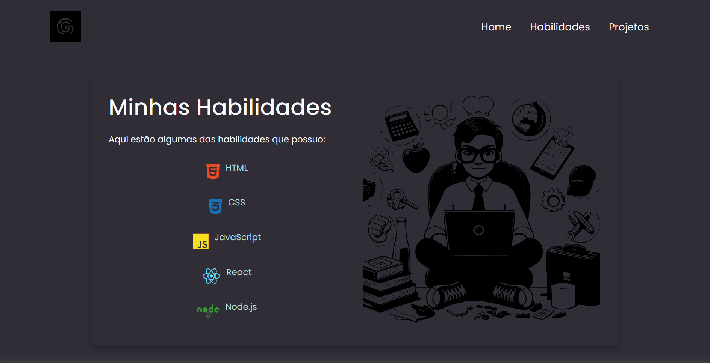
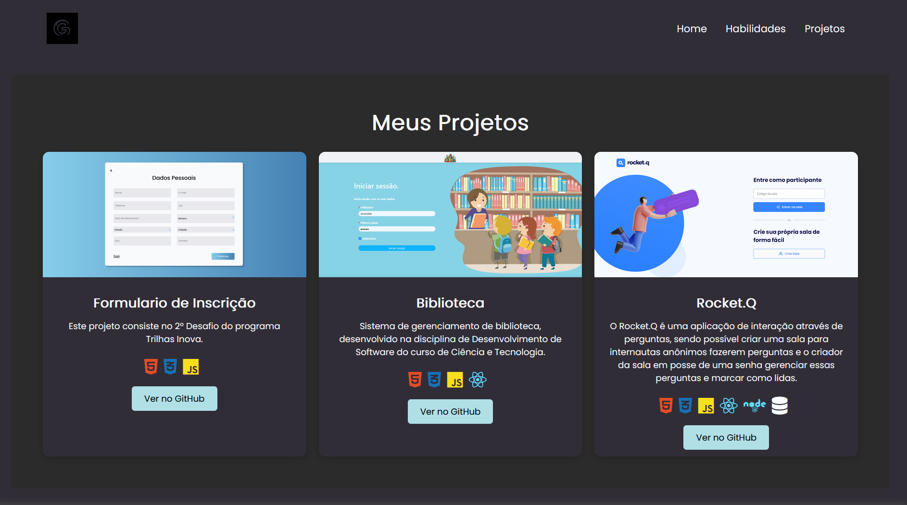

# Portfólio Pessoal - Guilherme Amorim

Este projeto consiste no 3º Desafio do programa Trilhas Inova. A iniciativa é uma parceria entre o Governo do Estado do Maranhão, a Secti e a Fapema, com o objetivo de capacitar jovens na área de tecnologia.

## Descrição

Este portfólio apresenta minhas habilidades e projetos como desenvolvedor. O portfólio inclui seções sobre minhas habilidades, projetos e uma breve introdução sobre mim.

## Tecnologias Utilizadas

- HTML
- CSS
- JavaScript

## Estrutura do Projeto

### Página Inicial (Home)

A página inicial apresenta uma breve introdução sobre mim e links para minhas redes sociais.

### Página de Habilidades

A página de habilidades lista minhas competências técnicas, destacando as tecnologias que utilizo.

### Página de Projetos

A página de projetos exibe meus principais trabalhos, com links para os repositórios no GitHub.

## Contato

Para mais informações, entre em contato através do [LinkedIn](https://www.linkedin.com/in/guilherme-de-padua-b484a3215/) ou [GitHub](https://github.com/guilhermedpadua).

## Licença

Este projeto está licenciado sob a Licença MIT. Consulte o arquivo LICENSE para obter mais detalhes.
